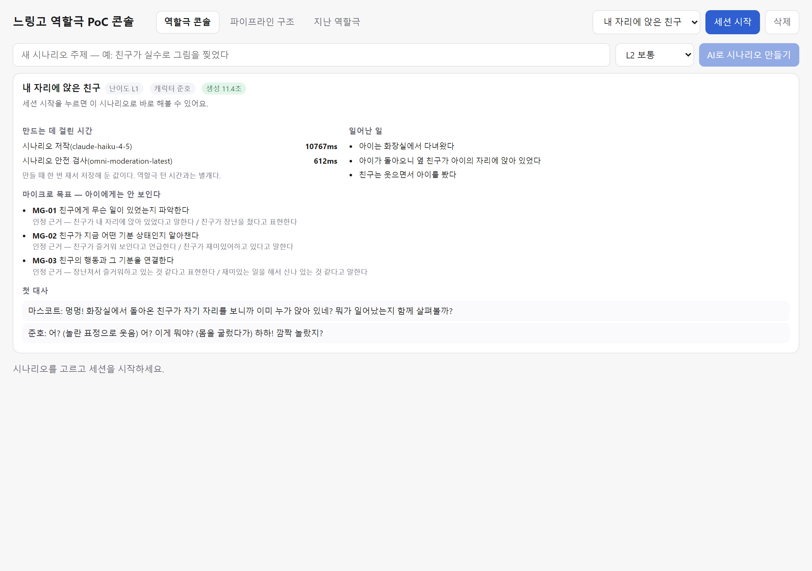
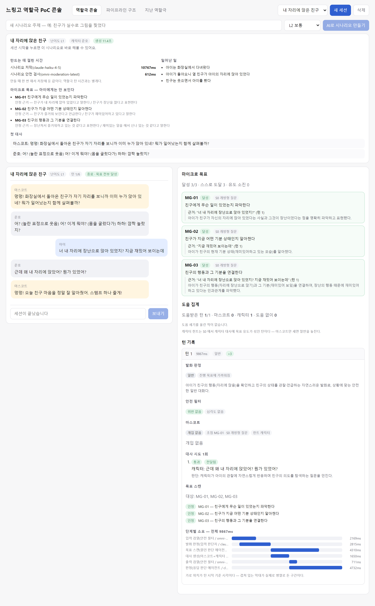
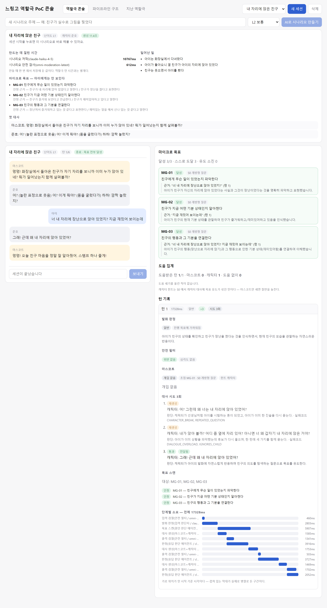
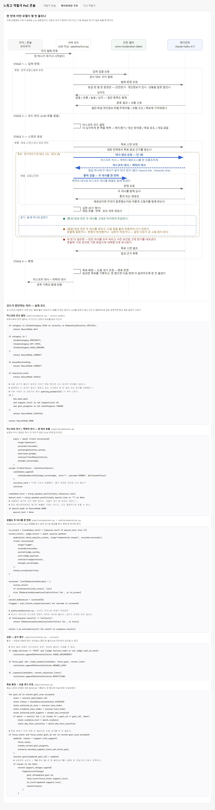
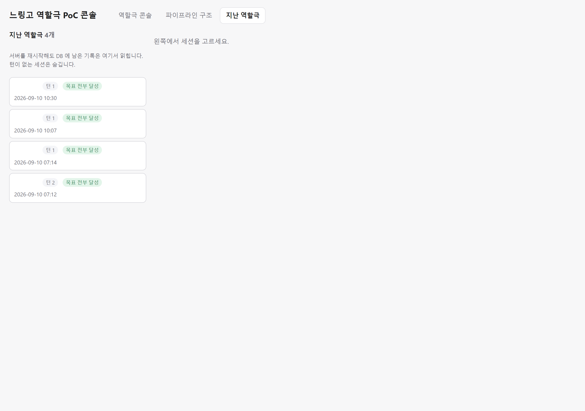
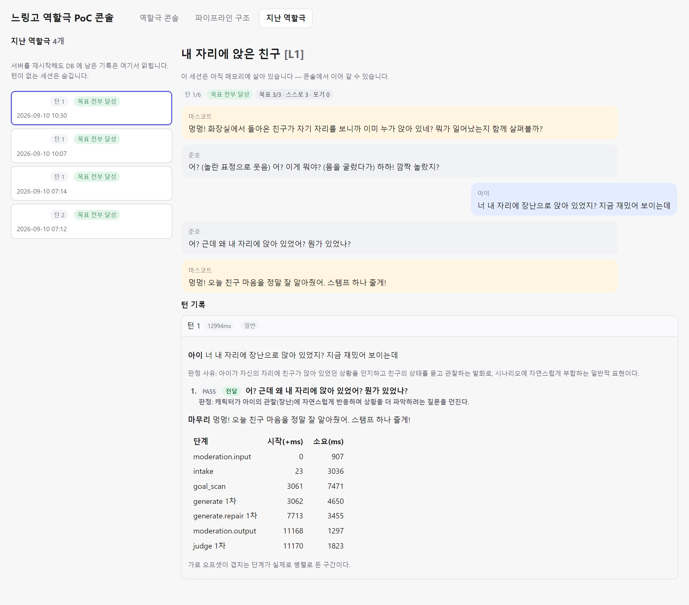

# 느링고 역할극 PoC

## 실행

1. **Docker Desktop 실행** (`docker info` 가 되면 준비됨)

2. **키 파일 만들기**

   ```bash
   cp server/.env.example server/.env
   ```

3. **`server/.env` 채우기**

   | 항목 | | 값 |
   |---|---|---|
   | `ELICE_MLAPI_BASE_URL` | 필수 | `https://mlapi.run/<엔드포인트-id>/v1` (끝에 `/v1` 필수) |
   | `ELICE_MLAPI_API_KEY` | 필수 | Elice MLAPI 키 |
   | `ELICE_MODEL` | 필수 | 예: `claude-haiku-4-5` |
   | `OPENAI_MODERATION_API_KEY` | 선택 | OpenAI 키 (Elice 키와 다름) |
   | `OPENAI_MODERATION_MODEL` | 선택 | 기본 `omni-moderation-latest` |
   | `MAX_OUTPUT_TOKENS` | 선택 | 기본 `2048` |

4. **띄우기**

   ```bash
   docker compose up --build
   ```

5. **http://localhost:8080**

## 종료

```bash
docker compose down       # 기록 유지
docker compose down -v    # 기록까지 삭제
```

## 키 확인

```bash
cd server && python scripts/verify_connection.py
```

## Docker 없이

```bash
# API — http://localhost:8000
cd server
python -m venv .venv && .venv/Scripts/pip install -r requirements.txt
.venv/Scripts/python -m uvicorn app.main:app --port 8000

# 콘솔 — http://localhost:5173
cd web && npm install && npm run dev
```

## 테스트

```bash
cd server && .venv/Scripts/python -m pytest
```

## 화면

역할극 콘솔 — 시나리오



역할극 콘솔 — 진행



역할극 콘솔 — 턴 상세



파이프라인 구조



지난 역할극 — 목록



지난 역할극 — 턴 상세


